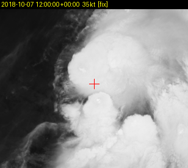
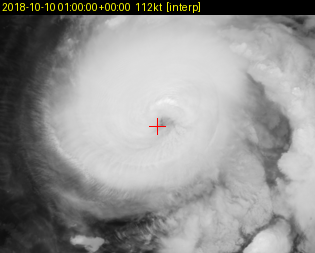
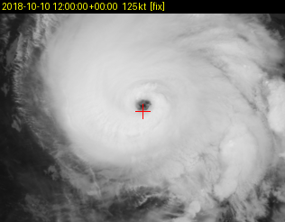

# Estimating hurricane intensity from GOES infrared imagery

This project trains a CNN to predict a tropical cyclone's maximum sustained
wind speed from a single GOES-16 infrared satellite image. Labels come from
NOAA's HURDAT2 best track database. The dataset covers 15 Atlantic storms
between 2018 and 2024.

On three storms the model never saw during training or checkpoint selection,
it gets a mean absolute error of **9.00 kt** (9.50 kt if you only score against
real 6-hourly HURDAT2 observations rather than interpolated ones). Operational
Dvorak estimates are usually quoted at 10-12 kt against best track, so that is
roughly comparable.

The number hides a real problem, though. The model consistently guesses too low
on strong storms, by about 19 kt at Category 4. That is discussed further down
and it is the more interesting part of the result.





Hurricane Michael over roughly three days in October 2018, from a
disorganized tropical storm to a Category 5 at landfall. Every frame is
centered on the HURDAT2 best-track position.

## Building the dataset

The two data sources do not line up. HURDAT2 gives you a storm's position and
intensity every 6 hours as a text file. GOES gives you a full-disk image of a
third of the planet every 10-15 minutes as NetCDF. Most of the work here is
matching them.

I sample hourly, which means most samples fall between HURDAT2 fixes. Center
position and wind speed are linearly interpolated for those, and every sample
carries a flag saying whether it came from a real fix or an interpolation. That
flag matters at evaluation time, since scoring against interpolated labels is
partly scoring against my own interpolation.

For each sample time I take the nearest full-disk scan within 10 minutes and
record the actual offset. At hourly sampling there are plenty of candidate
scans, so widening the window would mostly pull in frames where the storm has
moved far enough to sit off-center. Anything with no scan in range gets skipped
and logged rather than substituted.

The cropping is the part that took the longest to get right. ABI data is not
on a lat/lon grid. It sits on a fixed angular grid in geostationary projection,
where the coordinates are scan angles measured from the satellite, so a pixel
is a direction the instrument was pointing rather than a box on the ground.
Cutting a 600 km box around a given lat/lon means transforming into that
coordinate system first, using the projection parameters stored in each file
rather than constants I picked.

One consequence is that crops are not a fixed pixel size. Ground distance per
pixel changes with viewing angle, so a box near Florida covers a different
number of pixels than the same box near the Cape Verde islands. Across 2,092
crops there are about 600 distinct shapes, from 173 to 289 pixels tall and 273
to 326 wide. They all get resized to 224x224 when loaded.

Six crops turned out to contain NaN pixels. All six were at 05:00Z, spread
across three storms in three different years, which is the GOES-16 daily
housekeeping window when full-disk scans are degraded. I generate an exclusion
list by scanning for NaN rather than filtering on the hour, so the same check
picks up anything else bad later.

## The model

ResNet-18 with ImageNet weights, final layer swapped for a single regression
output. Brightness temperature is clamped to 180-320 K, scaled to 0-1, and
copied across three channels so the pretrained weights see the input shape they
expect. Wind labels are divided by a fixed 185 kt.

Trained with L1 loss, Adam at 1e-4, batch size 32, 20 epochs, on an RTX 5070.
I used L1 rather than MSE because most of the dataset is weak storms whose
best-track positions and intensities are genuinely uncertain, and squaring the
error would let a handful of Category 5 frames dominate the gradient.

## Splitting the data

Splits are by storm, never by frame. Hourly frames of the same hurricane are
almost identical images with almost identical labels, so a random row split
puts Michael's 14:00 frame in training and his 15:00 frame in test. The model
could then score well by recognizing a particular storm at a particular hour
instead of learning anything that transfers. The worst part is that this
failure looks like success, since the leaky version produces better numbers.

| Split | Storms | Samples |
|---|---|---|
| Train | Michael, Milton, Dorian, Fay, Ida, Nicholas, Idalia, Alberto, Debby | 1,307 |
| Validation | Sally, Ophelia, Laura | 386 |
| Held out | Ian, Nicole, Claudette | 393 |

The validation storms span tropical storm through Category 4 on purpose. My
first pick topped out at Category 2, which would have meant choosing the
checkpoint based almost entirely on how the model handled weak systems. The
held-out three were fixed before I ran any training and used once.

## Results

Held-out storms, 393 samples: **9.00 kt MAE overall, 9.50 kt on real HURDAT2
fixes only** (n=77). Those two being close is the check that mattered most,
since it means interpolated labels are not quietly inflating the score.

| Category | Samples | MAE | Bias |
|---|---|---|---|
| TD | 83 | 5.50 kt | +2.38 |
| TS | 187 | 7.59 kt | -2.74 |
| Cat 1 | 58 | 15.76 kt | -14.58 |
| Cat 2 | 9 | 3.96 kt | +0.24 |
| Cat 3 | 25 | 10.50 kt | +7.68 |
| Cat 4 | 15 | 19.49 kt | -19.49 |
| Cat 5 | 4 | 18.25 kt | -18.25 |

## What is wrong with it

The model underestimates strong storms. Bias is -19.49 kt at Category 4 and
-18.25 at Category 5, which are not small errors relative to the wind speeds
involved.

Part of this is the class balance. Most of the dataset is below hurricane
strength, so a model minimizing average error does well by staying near the
middle of the distribution and never committing to an extreme value.

The bigger reason is that the model only ever sees one frame. A storm that is
rapidly intensifying and one that is holding steady can look similar in a
single infrared image, because the signature of intensification is change over
time. Nothing in the input carries that. I noticed this early while flipping
through Michael's frames. The image at 12Z on October 7 is labeled 35 kt, but
everything visually interesting in it is convective bursts telling you what the
storm is about to become, not what it currently is. More training data will not
fix that, since it is a property of how the task is set up.

Category 1 is the worst band at 15.76 kt MAE and -14.58 bias, worse than
Category 2 or 3 despite sitting closer to the bulk of the data. I checked
whether one storm was responsible and it is not. Ian contributes 46 of those
samples at 14.8 kt error, Nicole 12 at 19.3 kt. Category 1 is roughly where a
storm first develops a visible eye, so frames in that range are structurally
ambiguous in infrared. Some have a ragged eye, some are still a central dense
overcast. That transition is also where conventional Dvorak analysis is
hardest.

Two other things I have not resolved. The dataset includes frames from after
landfall, where a storm's convective structure decays faster than its wind
field and the surface underneath is land rather than ocean, so the relationship
between appearance and intensity is different there. And best-track center
positions for tropical depressions are uncertain by something like 50-100 km,
a sizeable fraction of the crop width, so the weakest frames may be
contributing more noise than signal.

I should also say the 9.00 kt headline benefits from a held-out set that is
mostly weak storms. There is less room to be wrong at 30 kt than at 140. The
per-category table is the more honest view.

## What I would do next

Add more Category 3-5 storms and see whether the high-end bias shrinks. That
tests the class imbalance explanation directly, with the current 9.00 kt as a
baseline. I deliberately did not do this before writing up the result, since
changing the training data after seeing where the model failed would make the
number harder to trust.

Beyond that: feeding the network multiple frames or a frame difference so it
has some temporal context, adding the Band 8/9 water vapor channels (which
would also give the pretrained weights three real channels instead of three
copies of one), and running it against live NHC advisories during an active
storm.


## Repository

```
src/hurricane_intensity/   pipeline and dataset class
scripts/                   build, train, evaluate, previews
logs/decisions.md          running log of decisions and why I made them
```

Data is not committed. `scripts/build_batch.py --ids-file storms_train.txt`
rebuilds it from public NOAA sources.
